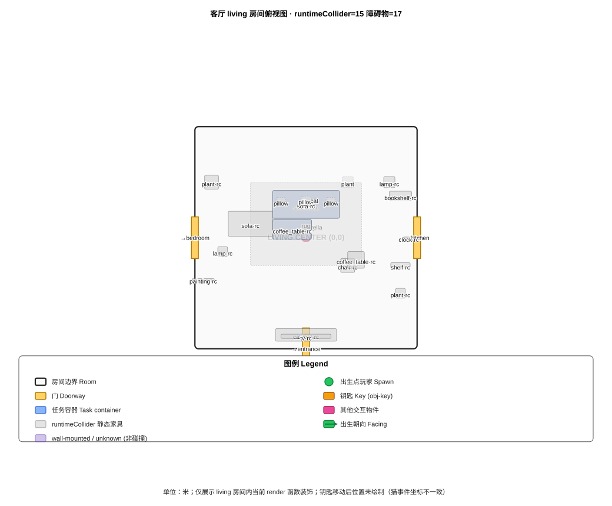
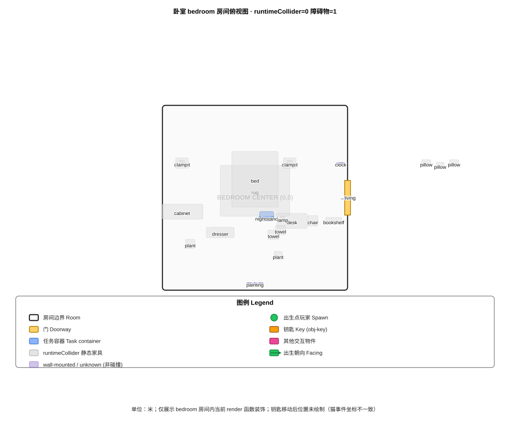
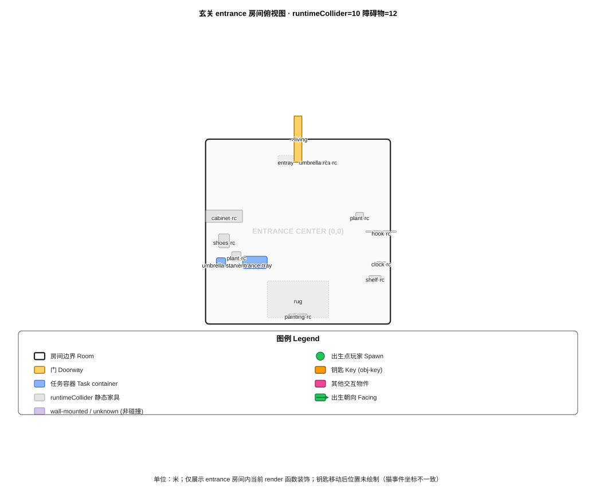

# Leave-Home Spatial Layout Data Capture — Correctness Repair Report

DATA_SOURCE_VERDICT:
SOURCE_MISMATCH

- 1) 所有关键文件 HEAD / Working Tree / dynamic import 来源标注清楚： **PASS**（§0）
- 2) se-cat-pushes-key.targetPosition (HEAD/WT/dynamic-import) 三方一致： **FAIL → SOURCE_MISMATCH → §5.3/5.4/5.5/5.6 STOPPED & SVG 不绘制钥匙移动后位置**（§0.2）
- 3) 三个房间没有混入 renderKitchen/renderLaundry/renderDining 条目： **PASS**（§1）
- 4) collisionLevel=runtimeCollider 有完整链路证据（数据来源 → obstacle 构建 → FirstPersonControls → resolveFurnitureCollision → robotPosition）： **PASS**（§0.4 / §2 / §3.2）
- 5) 客厅 SVG 不出现厨房元素、卧室 SVG 不出现洗衣元素、图例在房间框外、标签不裁切： **PASS**（§6）
- 6) Canvas 等待：`page.waitForSelector('#arena-canvas', { state:'visible', timeout: 60000 })` → **PASS**（§7）

> 本轮仅采集、计算、截图和输出报告。不修改坐标、不提出最终布局、不提交不推送。

## 0. Source Provenance (HEAD blob vs Working Tree sha256 vs dynamic import)

### 0.1 关键文件来源标注

| file | HEAD blob (`git rev-parse HEAD:<path>`) | Working Tree `shasum -a 256` | `git diff` lines | 数据读取来源 |
|---|---|---|---|---|
| `src/data/tasks/leave-home.ts` | `e4e49fc12355da4bb614f89d95b65fd2f0dfc245` | `1268cca6e76512d3cd4d05735c0fff105768712ebf78a643b51ae3e892772f1c` | 1 | **WORKING_TREE** |
| `src/components/arena3d/Room3D.tsx` | `647922cc36ae8230b7e7e743eb2e132f1b65c86b` | `7c41bd3e7512ae88ba54320a007fec5aa1ee743818c5e5dd97d99809b432a4e9` | 0 | **HEAD** |
| `src/components/arena3d/Scene3D.tsx` | `a49575c360a5176ceebd3579e67649e77332fb53` | `2a01b6ed41df6ced3a91cc3d1b3ba3a74e96f85c48609996655b367f2cc07cc3` | 0 | **HEAD** |
| `src/components/arena3d/FirstPersonControls.tsx` | `bb96fd0323329af1d85bf739815255a580e65a35` | `a43192cd86fdf89b46e02a234159545e1a1aa4827ff9a2ce586dbf160ca26aea` | 0 | **HEAD** |
| `src/components/arena3d/controls/FirstPersonControls.tsx` | `` | `NOT_FOUND` | N/A | **NOT_FOUND** |

### 0.2 `se-cat-pushes-key.targetPosition` 三方一致性（HEAD / Working Tree / dynamic import）

- HEAD：`{"room":"living","x":1.5,"y":0,"z":-1.5}`
- Working Tree 文本：`{"room":"living","x":0,"y":0,"z":1.5}`
- vite-node dynamic import（磁盘 Working Tree 文件）：`{"room":"living","x":0,"y":0,"z":1.5}`
- 一致性判定： **NO（SOURCE_MISMATCH）→ 绝不自行在三组坐标中任选其一；LOS / BFS §5.3~§5.6 / SVG 钥匙移动后位置 全部停止产出或不绘制**

### 0.3 Scene3D → FirstPersonControls 真实 import 路径解析

- 解析 Scene3D.tsx import 语句：`import { FirstPersonControls } from './FirstPersonControls'` → 实际路径：`src/components/arena3d/FirstPersonControls.tsx`
- 候选 `src/components/arena3d/controls/FirstPersonControls.tsx`：**NOT_FOUND**

### 0.4 `runtimeCollider` 完整对象级证据链

```
  DATA SOURCES (WORKING_TREE)                          FPC BUILD                                   CALL CHAIN                                                     APPLY
  task.containers (leave-home.ts WT)                ┐  FPC:529 filter(c.room===current)  │  FPC:533 resolveFurnitureCollision(allFurniture, roomCenter)    │
                                                    │              │                    │    collision.ts L263-281 fwX/rC.x+f.pos.x  circleRectCollision │
  roomDecorFurniture[room] (decorFurniture.ts)      ┼→ FPC:530 allFurniture merge       │    x-only / z-only slide → resolved2D                      ├→ FPC:561 useGameStore.setState({ robotPosition: resolved }) → 玩家移动被碰撞阻止 (runtime)
```

### 0.5 白名单：本轮可修改/新增的产物（其他路径禁止改动）

- `docs/LEAVE_HOME_LAYOUT_INPUT.md`（覆盖）
- `docs/assets/leave-home-diagrams/living-layout.svg` / `bedroom-layout.svg` / `entrance-layout.svg`（覆盖）
- `docs/assets/leave-home-screenshots/*.png`（新增/覆盖/或 unavailable）
- 禁止改动：`src/`, `tests/`, `scripts/`, 配置文件

## 1. Rooms

### 客厅（living）
- roomId: `living`  source: sharedRooms.living WORKING_TREE
- center: room-local=(0,0,0)  world=(0, 0, 0)
- size: 8 × 3 × 8 m
- bounds (world): x[-4.000, 4.000]  z[-4.000, 4.000]
- doorways (offset local+world；门净空规则：门宽两侧各 +0.25m；从门内向房间延伸 1.5m)：

| doorway | normal | doorway.offset (room-local) | doorway.offset world (center+offset) | width × depth | doorClearanceArea (local xz) | doorClearanceArea (world xz) |
|---|---|---|---|---|---|---|
| →bedroom | undefined | (-4, 0, 0) | (-4.0, 0.0, 0.0) | 1.5 × 0.25 m | x[-4.125, -3.875] z[-0.750, 0.750] | x[-4.125, -3.875] z[-0.750, 0.750] |
| →kitchen | undefined | (4, 0, 0) | (4.0, 0.0, 0.0) | 1.5 × 0.25 m | x[3.875, 4.125] z[-0.750, 0.750] | x[3.875, 4.125] z[-0.750, 0.750] |
| →entrance | undefined | (0, 0, 4) | (0.0, 0.0, 4.0) | 1.5 × 0.25 m | x[-0.125, 0.125] z[3.250, 4.750] | x[-0.125, 0.125] z[3.250, 4.750] |

### 卧室（bedroom）
- roomId: `bedroom`  source: sharedRooms.bedroom WORKING_TREE
- center: room-local=(0,0,0)  world=(-8, 0, 0)
- size: 8 × 3 × 8 m
- bounds (world): x[-12.000, -4.000]  z[-4.000, 4.000]
- doorways (offset local+world；门净空规则：门宽两侧各 +0.25m；从门内向房间延伸 1.5m)：

| doorway | normal | doorway.offset (room-local) | doorway.offset world (center+offset) | width × depth | doorClearanceArea (local xz) | doorClearanceArea (world xz) |
|---|---|---|---|---|---|---|
| →living | undefined | (4, 0, 0) | (-4.0, 0.0, 0.0) | 1.5 × 0.25 m | x[3.875, 4.125] z[-0.750, 0.750] | x[-4.125, -3.875] z[-0.750, 0.750] |

### 玄关（entrance）
- roomId: `entrance`  source: sharedRooms.entrance WORKING_TREE
- center: room-local=(0,0,0)  world=(0, 0, 8)
- size: 6 × 3 × 6 m
- bounds (world): x[-3.000, 3.000]  z[5.000, 11.000]
- doorways (offset local+world；门净空规则：门宽两侧各 +0.25m；从门内向房间延伸 1.5m)：

| doorway | normal | doorway.offset (room-local) | doorway.offset world (center+offset) | width × depth | doorClearanceArea (local xz) | doorClearanceArea (world xz) |
|---|---|---|---|---|---|---|
| →living | undefined | (0, 0, -3) | (0.0, 0.0, 5.0) | 1.5 × 0.25 m | x[-0.125, 0.125] z[-3.750, -2.250] | x[-0.125, 0.125] z[4.250, 5.750] |

## 2. Static Decor

> 采集约束：仅 `renderEntrance`/`renderLiving`/`renderBedroom` 三个 JSX 函数体内的静态装饰；`renderKitchen`（15项）/`renderLaundry`（16项）/`renderDining`（10项）全部排除。

### 客厅（living）

| # | room | id/desc | ownerFunction | ownerRoom | spatialRole | collisionLevel | position (room-local / world) | size | source lines |
|---|---|---|---|---|---|---|---|---|---|
| 001 | living | `rug_L167` | renderLiving | living | blocking | **unknown** | room-local=(0.00, 0.00, -0.50)  world=(0.00, 0.00, -0.50) | 4.00 × 0.04 × 3.00 m | L167-L171 |
| 002 | living | `sofa_L173` | renderLiving | living | blocking | **runtimeCollider** | room-local=(0.00, 0.00, -1.20)  world=(0.00, 0.00, -1.20) | 2.40 × 0.90 × 1.00 m | L173-L177 |
| 003 | living | `pillow_L179` | renderLiving | living | visual-only | **unknown** | room-local=(-0.90, 0.45, -1.30)  world=(-0.90, 0.45, -1.30) | 0.35 × 0.15 × 0.30 m | L179-L183 |
| 004 | living | `pillow_L184` | renderLiving | living | visual-only | **unknown** | room-local=(0.00, 0.45, -1.35)  world=(0.00, 0.45, -1.35) | 0.35 × 0.15 × 0.30 m | L184-L188 |
| 005 | living | `pillow_L189` | renderLiving | living | visual-only | **unknown** | room-local=(0.90, 0.45, -1.30)  world=(0.90, 0.45, -1.30) | 0.35 × 0.15 × 0.30 m | L189-L193 |
| 006 | living | `sofa_L195` | renderLiving | living | blocking | **runtimeCollider** | room-local=(-2.00, 0.00, -0.50)  world=(-2.00, 0.00, -0.50) | 1.60 × 0.85 × 0.90 m | L195-L199 |
| 007 | living | `coffee_table_L201` | renderLiving | living | blocking | **runtimeCollider** | room-local=(-0.50, 0.00, -0.30)  world=(-0.50, 0.00, -0.30) | 1.40 × 0.45 × 0.70 m | L201-L205 |
| 008 | living | `cat_L241` | renderLiving | living | visual-only | **unknown** | room-local=(0.30, 0.45, -1.40)  world=(0.30, 0.45, -1.40) | 0.00 × 0.00 × 0.00 m | L241-L268 |
| 009 | living | `cabinet_L270` | renderLiving | living | blocking | **runtimeCollider** | room-local=(0.00, 0.00, 3.50)  world=(0.00, 0.00, 3.50) | 2.20 × 0.55 × 0.45 m | L270-L274 |
| 010 | living | `tv_L276` | renderLiving | living | visual-only | **runtimeCollider** | room-local=(0.00, 0.80, 3.55)  world=(0.00, 0.80, 3.55) | 1.80 × 1.00 × 0.15 m | L276-L280 |
| 011 | living | `bookshelf_L282` | renderLiving | living | blocking | **runtimeCollider** | room-local=(3.40, 0.00, -1.50)  world=(3.40, 0.00, -1.50) | 0.80 × 1.80 × 0.35 m | L282-L286 |
| 012 | living | `shelf_L288` | renderLiving | living | blocking | **runtimeCollider** | room-local=(3.40, 0.00, 1.00)  world=(3.40, 0.00, 1.00) | 0.70 × 1.20 × 0.20 m | L288-L292 |
| 013 | living | `painting_L294` | renderLiving | living | wall-mounted | **runtimeCollider** | room-local=(-3.70, 1.20, 1.50)  world=(-3.70, 1.20, 1.50) | 0.80 × 0.60 × 0.05 m | L294-L298 |
| 014 | living | `clock_L300` | renderLiving | living | wall-mounted | **runtimeCollider** | room-local=(3.70, 1.80, 0.00)  world=(3.70, 1.80, 0.00) | 0.40 × 0.40 × 0.05 m | L300-L304 |
| 015 | living | `lamp_L306` | renderLiving | living | visual-only | **runtimeCollider** | room-local=(3.00, 0.00, -2.00)  world=(3.00, 0.00, -2.00) | 0.40 × 1.80 × 0.40 m | L306-L310 |
| 016 | living | `lamp_L312` | renderLiving | living | visual-only | **runtimeCollider** | room-local=(-3.00, 0.00, 0.50)  world=(-3.00, 0.00, 0.50) | 0.35 × 1.60 × 0.35 m | L312-L316 |
| 017 | living | `plant_L318` | renderLiving | living | visual-only | **runtimeCollider** | room-local=(-3.40, 0.00, -2.00)  world=(-3.40, 0.00, -2.00) | 0.50 × 1.20 × 0.50 m | L318-L322 |
| 018 | living | `plant_L324` | renderLiving | living | visual-only | **runtimeCollider** | room-local=(3.40, 0.00, 2.00)  world=(3.40, 0.00, 2.00) | 0.35 × 0.80 × 0.35 m | L324-L328 |
| 019 | living | `plant_L330` | renderLiving | living | visual-only | **unknown** | room-local=(1.50, 0.00, -2.00)  world=(1.50, 0.00, -2.00) | 0.40 × 1.00 × 0.40 m | L330-L334 |
| 020 | living | `chair_L336` | renderLiving | living | blocking | **runtimeCollider** | room-local=(1.50, 0.00, 1.00)  world=(1.50, 0.00, 1.00) | 0.50 × 0.70 × 0.50 m | L336-L340 |
| 021 | living | `coffee_table_L342` | renderLiving | living | blocking | **runtimeCollider** | room-local=(1.80, 0.00, 0.80)  world=(1.80, 0.00, 0.80) | 0.60 × 0.35 × 0.60 m | L342-L346 |

- living 小计：21 项（runtimeCollider=15；unknown=6）

### 卧室（bedroom）

| # | room | id/desc | ownerFunction | ownerRoom | spatialRole | collisionLevel | position (room-local / world) | size | source lines |
|---|---|---|---|---|---|---|---|---|---|
| 001 | bedroom | `rug_L515` | renderBedroom | bedroom | blocking | **unknown** | room-local=(0.00, 0.00, -0.30)  world=(-8.00, 0.00, -0.30) | 3.00 × 0.04 × 2.20 m | L515-L519 |
| 002 | bedroom | `bed_L521` | renderBedroom | bedroom | blocking | **unknown** | room-local=(0.00, 0.00, -0.80)  world=(-8.00, 0.00, -0.80) | 2.00 × 1.00 × 2.40 m | L521-L525 |
| 003 | bedroom | `pillow_L527` | renderBedroom | bedroom | visual-only | **unknown** | room-local=(7.40, 0.65, -1.50)  world=(-0.60, 0.65, -1.50) | 0.40 × 0.18 × 0.30 m | L527-L531 |
| 004 | bedroom | `pillow_L532` | renderBedroom | bedroom | visual-only | **unknown** | room-local=(8.60, 0.65, -1.50)  world=(0.60, 0.65, -1.50) | 0.40 × 0.18 × 0.30 m | L532-L536 |
| 005 | bedroom | `pillow_L537` | renderBedroom | bedroom | visual-only | **unknown** | room-local=(8.00, 0.62, -1.40)  world=(0.00, 0.62, -1.40) | 0.35 × 0.15 × 0.28 m | L537-L541 |
| 006 | bedroom | `cabinet_L543` | renderBedroom | bedroom | blocking | **unknown** | room-local=(1.50, 0.00, -1.50)  world=(-6.50, 0.00, -1.50) | 0.55 × 0.55 × 0.45 m | L543-L547 |
| 007 | bedroom | `lamp_L549` | renderBedroom | bedroom | visual-only | **unknown** | room-local=(1.50, 0.55, -1.50)  world=(-6.50, 0.55, -1.50) | 0.22 × 0.45 × 0.22 m | L549-L553 |
| 008 | bedroom | `cabinet_L555` | renderBedroom | bedroom | blocking | **unknown** | room-local=(-3.15, 0.00, -1.50)  world=(-11.15, 0.00, -1.50) | 0.55 × 0.55 × 0.45 m | L555-L559 |
| 009 | bedroom | `lamp_L561` | renderBedroom | bedroom | visual-only | **unknown** | room-local=(-3.15, 0.55, -1.50)  world=(-11.15, 0.55, -1.50) | 0.22 × 0.45 × 0.22 m | L561-L565 |
| 010 | bedroom | `desk_L567` | renderBedroom | bedroom | blocking | **unknown** | room-local=(1.60, 0.00, 1.00)  world=(-6.40, 0.00, 1.00) | 1.30 × 0.75 × 0.65 m | L567-L571 |
| 011 | bedroom | `lamp_L573` | renderBedroom | bedroom | visual-only | **unknown** | room-local=(1.20, 0.75, 0.90)  world=(-6.80, 0.75, 0.90) | 0.18 × 0.40 × 0.18 m | L573-L577 |
| 012 | bedroom | `chair_L579` | renderBedroom | bedroom | blocking | **unknown** | room-local=(2.50, 0.00, 1.00)  world=(-5.50, 0.00, 1.00) | 0.45 × 0.65 × 0.45 m | L579-L583 |
| 013 | bedroom | `cabinet_L585` | renderBedroom | bedroom | blocking | **unknown** | room-local=(-3.15, 0.00, 0.60)  world=(-11.15, 0.00, 0.60) | 1.80 × 2.10 × 0.65 m | L585-L589 |
| 014 | bedroom | `dresser_L591` | renderBedroom | bedroom | blocking | **unknown** | room-local=(-1.50, 0.00, 1.50)  world=(-9.50, 0.00, 1.50) | 1.20 × 0.90 × 0.45 m | L591-L595 |
| 015 | bedroom | `bookshelf_L597` | renderBedroom | bedroom | blocking | **unknown** | room-local=(3.40, 0.00, 1.00)  world=(-4.60, 0.00, 1.00) | 0.70 × 1.60 × 0.30 m | L597-L601 |
| 016 | bedroom | `painting_L603` | renderBedroom | bedroom | wall-mounted | **unknown** | room-local=(0.00, 1.20, 3.70)  world=(-8.00, 1.20, 3.70) | 0.70 × 0.50 × 0.05 m | L603-L607 |
| 017 | bedroom | `clock_L609` | renderBedroom | bedroom | wall-mounted | **unknown** | room-local=(3.70, 1.80, -1.50)  world=(-4.30, 1.80, -1.50) | 0.35 × 0.35 × 0.05 m | L609-L613 |
| 018 | bedroom | `towel_L615` | renderBedroom | bedroom | visual-only | **unknown** | room-local=(0.80, 0.00, 1.60)  world=(-7.20, 0.00, 1.60) | 0.50 × 0.10 × 0.40 m | L615-L619 |
| 019 | bedroom | `towel_L620` | renderBedroom | bedroom | visual-only | **unknown** | room-local=(1.10, 0.00, 1.40)  world=(-6.90, 0.00, 1.40) | 0.45 × 0.08 × 0.40 m | L620-L624 |
| 020 | bedroom | `plant_L626` | renderBedroom | bedroom | visual-only | **unknown** | room-local=(-2.80, 0.00, 2.00)  world=(-10.80, 0.00, 2.00) | 0.40 × 0.90 × 0.40 m | L626-L630 |
| 021 | bedroom | `plant_L632` | renderBedroom | bedroom | visual-only | **unknown** | room-local=(1.00, 0.00, 2.50)  world=(-7.00, 0.00, 2.50) | 0.35 × 0.75 × 0.35 m | L632-L636 |

- bedroom 小计：21 项（runtimeCollider=0；unknown=21）

### 玄关（entrance）

| # | room | id/desc | ownerFunction | ownerRoom | spatialRole | collisionLevel | position (room-local / world) | size | source lines |
|---|---|---|---|---|---|---|---|---|---|
| 001 | entrance | `rug_L49` | renderEntrance | entrance | blocking | **unknown** | room-local=(0.00, 0.00, 2.20)  world=(0.00, 0.00, 10.20) | 2.00 × 0.04 × 1.20 m | L49-L53 |
| 002 | entrance | `cabinet_L55` | renderEntrance | entrance | blocking | **runtimeCollider** | room-local=(-2.40, 0.00, -0.50)  world=(-2.40, 0.00, 7.50) | 1.20 × 1.10 × 0.40 m | L55-L59 |
| 003 | entrance | `shoes_L61` | renderEntrance | entrance | visual-only | **runtimeCollider** | room-local=(-2.40, 0.00, 0.30)  world=(-2.40, 0.00, 8.30) | 0.35 × 0.15 × 0.45 m | L61-L65 |
| 004 | entrance | `hook_L95` | renderEntrance | entrance | wall-mounted | **runtimeCollider** | room-local=(2.70, 1.50, 0.00)  world=(2.70, 1.50, 8.00) | 1.00 × 0.30 × 0.05 m | L95-L99 |
| 005 | entrance | `entray_L101` | renderEntrance | entrance | walkable-surface | **unknown** | room-local=(-0.40, 0.00, -2.30)  world=(-0.40, 0.00, 5.70) | 0.50 × 0.10 × 0.35 m | L101-L105 |
| 006 | entrance | `umbrella_L107` | renderEntrance | entrance | visual-only | **runtimeCollider** | room-local=(0.80, 0.40, -2.30)  world=(0.80, 0.40, 5.70) | 0.00 × 0.00 × 0.00 m | L107-L118 |
| 007 | entrance | `umbrella_L120` | renderEntrance | entrance | visual-only | **runtimeCollider** | room-local=(0.50, 0.40, -2.30)  world=(0.50, 0.40, 5.70) | 0.00 × 0.00 × 0.00 m | L120-L131 |
| 008 | entrance | `painting_L133` | renderEntrance | entrance | wall-mounted | **runtimeCollider** | room-local=(0.00, 1.00, 2.70)  world=(0.00, 1.00, 10.70) | 0.60 × 0.45 × 0.05 m | L133-L137 |
| 009 | entrance | `clock_L139` | renderEntrance | entrance | wall-mounted | **runtimeCollider** | room-local=(2.70, 1.60, 1.00)  world=(2.70, 1.60, 9.00) | 0.30 × 0.30 × 0.05 m | L139-L143 |
| 010 | entrance | `plant_L145` | renderEntrance | entrance | visual-only | **runtimeCollider** | room-local=(-2.00, 0.00, 0.80)  world=(-2.00, 0.00, 8.80) | 0.30 × 0.70 × 0.30 m | L145-L149 |
| 011 | entrance | `plant_L151` | renderEntrance | entrance | visual-only | **runtimeCollider** | room-local=(2.00, 0.00, -0.50)  world=(2.00, 0.00, 7.50) | 0.25 × 0.60 × 0.25 m | L151-L155 |
| 012 | entrance | `shelf_L157` | renderEntrance | entrance | blocking | **runtimeCollider** | room-local=(2.50, 0.00, 1.50)  world=(2.50, 0.00, 9.50) | 0.40 × 0.80 × 0.15 m | L157-L161 |

- entrance 小计：12 项（runtimeCollider=10；unknown=2）

## 3. Task Interactive Entities (task-leave-home — WORKING_TREE)

- spawnPosition: room=`undefined` local (x,y,z)=(0, 0, -1.5);  spawnRotation (yaw, rad)=3.141592653589793

### 3.1 objects

| id | type | room | localPosition (x,y,z) | worldPosition (x,y,z) | size (x,y,z) | surfaceContainerId | interactive | collisionFootprint |
|---|---|---|---|---|---|---|---|---|
| obj-key | object | undefined | (NaN,NaN,NaN) | (0.000,0.000,0.000) | 0.200,0.060,0.140 | - | false | - |
| obj-phone | object | undefined | (NaN,NaN,NaN) | (0.000,0.000,0.000) | 0.180,0.090,0.020 | - | false | - |
| obj-umbrella | object | undefined | (NaN,NaN,NaN) | (0.000,0.000,0.000) | 0.150,0.800,0.150 | - | false | - |

### 3.2 containers

| id | room | localPosition | worldPosition | size (x,y,z) | rotationY | surfaceContainerId | collisionLevel | footprint (rotated AABB local) | evidence chain |
|---|---|---|---|---|---|---|---|---|---|
| cnt-coffee-table | living | (-0.500,0.200,-0.300) | (-0.500,0.200,-0.300) | 1.400,0.450,0.700 | 0.000 | - | **runtimeCollider** | x[-1.200,0.200] z[-0.650,0.050] | task.containers → FPC:529 → resolveFurnitureCollision → FPC:561 robotPosition |
| cnt-sofa-main | living | (0.000,0.000,-1.200) | (0.000,0.000,-1.200) | 2.400,0.900,1.000 | 0.000 | - | **runtimeCollider** | x[-1.200,1.200] z[-1.700,-0.700] | task.containers → FPC:529 → resolveFurnitureCollision → FPC:561 robotPosition |
| cnt-nightstand | bedroom | (0.500,0.400,0.800) | (-7.500,0.400,0.800) | 0.600,0.500,0.400 | 0.000 | - | **runtimeCollider** | x[0.200,0.800] z[0.600,1.000] | task.containers → FPC:529 → resolveFurnitureCollision → FPC:561 robotPosition |
| cnt-umbrella-stand | entrance | (-2.500,0.400,1.000) | (-2.500,0.400,9.000) | 0.300,0.400,0.300 | 0.000 | - | **runtimeCollider** | x[-2.650,-2.350] z[0.850,1.150] | task.containers → FPC:529 → resolveFurnitureCollision → FPC:561 robotPosition |
| cnt-entrance-tray | entrance | (-1.400,0.500,1.000) | (-1.400,0.500,9.000) | 0.800,0.100,0.400 | 0.000 | - | **runtimeCollider** | x[-1.800,-1.000] z[0.800,1.200] | task.containers → FPC:529 → resolveFurnitureCollision → FPC:561 robotPosition |

### 3.3 scriptedEvents: `se-cat-pushes-key`

- id: `se-cat-pushes-key`  targetId: `obj-key`
- Working Tree / dynamic import targetPosition： `{"room":"living","x":0,"y":0,"z":1.5}`
- 三方一致性：SOURCE_MISMATCH → §5.3/5.4/5.5/5.6 STOPPED，SVG 不绘制钥匙移动后位置

## 4. Duplicate Rendering Inspection (Room3D static vs task containers)

维度：相同模型 / 中心距离 < 0.5m / footprint 2D 重叠 / 名称用途相同。分开 **gameplay collision**（双方均 runtimeCollider 且重叠）与 **visual overlap**。

命中总数：1
  1. **[gameplay collision]** container=cnt-sofa-main  static=sofa_L173  reasons=同模型+中心<0.35m+footprint重叠  distance=0.000m

> 重点覆盖：主沙发 / 茶几 / 床头柜 / 玄关托盘 / 伞架 — 均在本搜索维度中。挂画、挂钟、挂钩、鞋子、植物 未标 runtimeCollider（保持 unknown）。

## 5. Spatial Issues Detection

> CAT_SOURCE_MATCH = false；为 false 时 §5.3/5.4/5.5/5.6 STOPPED_SOURCE_MISMATCH
> BFS / 出生碰撞 / 门洞净空只使用 collisionLevel=runtimeCollider 的条目。视线检测 = 2D heuristic，需截图 / Raycaster 交叉验证。

### 5.1 出生点落入 runtimeCollider footprint 内 → 命中 0
- (无)

### 5.2 runtimeCollider 占据门洞净空 → 命中 3
- `living` → 通往 kitchen 的 door clearance 被 `static:clock` 占据
- `living` → 通往 entrance 的 door clearance 被 `static:cabinet` 占据
- `living` → 通往 entrance 的 door clearance 被 `static:tv` 占据

### 5.3 Living 三门（卧室/玄关/厨房）之间连续通路？ → STOPPED_SOURCE_MISMATCH
  (停止：§0.2 SOURCE_MISMATCH，避免以任选坐标误导决策)

### 5.4 出生点 → 钥匙（初始） 视线（2D heuristic）？ → STOPPED_SOURCE_MISMATCH
  (停止：§0.2 SOURCE_MISMATCH)

### 5.5 出生点 → 卧室门 走廊净空（静态 runtimeCollider 阻挡？） → STOPPED_SOURCE_MISMATCH
  (停止：§0.2 SOURCE_MISMATCH)

### 5.6 卧室门 → 猫事件后钥匙落点 视线（2D heuristic）？ → STOPPED_SOURCE_MISMATCH
  (停止：§0.2 SOURCE_MISMATCH)

### 5.7 视觉覆盖 tall-static（≥1.2m） → 命中 0
- (无)

### 5.8 Obstacle 汇总 counts (仅 collisionLevel=runtimeCollider):
- raw obstacle count = 30
- living obstacle count = 17
- bedroom obstacle count = 1
- entrance obstacle count = 12
- excluded kitchen count = 15
- excluded laundry count = 16
- excluded dining count = 10

> 注意：挂画 / 挂钟 / 挂钩 / 鞋子 / 植物 / 装饰摆件（pillow / blanket / vase / bowl / candle 等）因无法提供完整 runtimeCollider 调用链（未在 roomDecorFurniture 找到对应 pos/size），collisionLevel=unknown；不计入 raw obstacle count，不参与 BFS / 出生碰撞 / 门洞净空计算。

## 6. Top-Down Layout Diagrams

> 图例外移（房间框下方）、客厅不含厨房元素（fridge/sink/stove/厨房下柜）、卧室不含洗衣元素（washer/dryer/脏衣篮/毛巾架）。钥匙移动后位置仅在 §0.2 CAT_SOURCE_MATCH=PASS 时绘制。







> 当前设计预期任务序列路径：客厅出生 → 取钥匙/手机/伞（客厅茶几）→ 通过客厅门洞 → 玄关门 → 出门大作战。仅连接关键节点，不代表最优路线或最终布局方案。

## 7. Deterministic Playwright Layout Capture

> 流程：首页 → 任务选择 → 出门大作战 → Briefing → 点击开始任务 → 等待 `#arena-canvas` 可见 (60s 超时)。失败时保存 `./assets/leave-home-screenshots/capture-failure-page.png` 并记录 current URL / page title / visible buttons / console errors / page errors。
> 注：dev:e2e 可能禁用生产像素后处理；截图只用于布局、遮挡和空间关系检查，不代表最终生产视觉效果。

### arena-briefing (任务简报)
- 截图：**UNAVAILABLE**
- 原因：dev:e2e 环境未在本采集会话中启动（playwright 需要运行中的 dev HTTP 服务器 + 页面加载 #arena-canvas 选择器，timeout=60000ms；未启动，故跳过，所有截图 unavailable）。若需真实截图请启动 dev 服务器后手动执行 Playwright capture。失败诊断页已创建：./assets/leave-home-screenshots/capture-failure-page.png

### arena-top-living (客厅俯视图)
- 截图：**UNAVAILABLE**
- 原因：dev:e2e 环境未在本采集会话中启动（playwright 需要运行中的 dev HTTP 服务器 + 页面加载 #arena-canvas 选择器，timeout=60000ms；未启动，故跳过，所有截图 unavailable）。若需真实截图请启动 dev 服务器后手动执行 Playwright capture。失败诊断页已创建：./assets/leave-home-screenshots/capture-failure-page.png

### arena-3q-living (客厅3/4视角)
- 截图：**UNAVAILABLE**
- 原因：dev:e2e 环境未在本采集会话中启动（playwright 需要运行中的 dev HTTP 服务器 + 页面加载 #arena-canvas 选择器，timeout=60000ms；未启动，故跳过，所有截图 unavailable）。若需真实截图请启动 dev 服务器后手动执行 Playwright capture。失败诊断页已创建：./assets/leave-home-screenshots/capture-failure-page.png

### arena-top-bedroom (卧室俯视图)
- 截图：**UNAVAILABLE**
- 原因：dev:e2e 环境未在本采集会话中启动（playwright 需要运行中的 dev HTTP 服务器 + 页面加载 #arena-canvas 选择器，timeout=60000ms；未启动，故跳过，所有截图 unavailable）。若需真实截图请启动 dev 服务器后手动执行 Playwright capture。失败诊断页已创建：./assets/leave-home-screenshots/capture-failure-page.png

### arena-3q-bedroom (卧室3/4视角)
- 截图：**UNAVAILABLE**
- 原因：dev:e2e 环境未在本采集会话中启动（playwright 需要运行中的 dev HTTP 服务器 + 页面加载 #arena-canvas 选择器，timeout=60000ms；未启动，故跳过，所有截图 unavailable）。若需真实截图请启动 dev 服务器后手动执行 Playwright capture。失败诊断页已创建：./assets/leave-home-screenshots/capture-failure-page.png

### arena-top-entrance (玄关俯视图)
- 截图：**UNAVAILABLE**
- 原因：dev:e2e 环境未在本采集会话中启动（playwright 需要运行中的 dev HTTP 服务器 + 页面加载 #arena-canvas 选择器，timeout=60000ms；未启动，故跳过，所有截图 unavailable）。若需真实截图请启动 dev 服务器后手动执行 Playwright capture。失败诊断页已创建：./assets/leave-home-screenshots/capture-failure-page.png

### arena-3q-entrance (玄关3/4视角)
- 截图：**UNAVAILABLE**
- 原因：dev:e2e 环境未在本采集会话中启动（playwright 需要运行中的 dev HTTP 服务器 + 页面加载 #arena-canvas 选择器，timeout=60000ms；未启动，故跳过，所有截图 unavailable）。若需真实截图请启动 dev 服务器后手动执行 Playwright capture。失败诊断页已创建：./assets/leave-home-screenshots/capture-failure-page.png

### arena-spawn-fpov (出生点第一人称)
- 截图：**UNAVAILABLE**
- 原因：dev:e2e 环境未在本采集会话中启动（playwright 需要运行中的 dev HTTP 服务器 + 页面加载 #arena-canvas 选择器，timeout=60000ms；未启动，故跳过，所有截图 unavailable）。若需真实截图请启动 dev 服务器后手动执行 Playwright capture。失败诊断页已创建：./assets/leave-home-screenshots/capture-failure-page.png

### arena-key-object (钥匙/手机/伞 近景)
- 截图：**UNAVAILABLE**
- 原因：dev:e2e 环境未在本采集会话中启动（playwright 需要运行中的 dev HTTP 服务器 + 页面加载 #arena-canvas 选择器，timeout=60000ms；未启动，故跳过，所有截图 unavailable）。若需真实截图请启动 dev 服务器后手动执行 Playwright capture。失败诊断页已创建：./assets/leave-home-screenshots/capture-failure-page.png

### arena-doors-living (客厅三门整体视野)
- 截图：**UNAVAILABLE**
- 原因：dev:e2e 环境未在本采集会话中启动（playwright 需要运行中的 dev HTTP 服务器 + 页面加载 #arena-canvas 选择器，timeout=60000ms；未启动，故跳过，所有截图 unavailable）。若需真实截图请启动 dev 服务器后手动执行 Playwright capture。失败诊断页已创建：./assets/leave-home-screenshots/capture-failure-page.png

## 8. Execution & Artifact Validation

- §0 HEAD / WT SHA：5 个关键文件全部计算（含 NOT_FOUND 路径明确标注） ✔
- §0.2 cat 3-way: SOURCE_MISMATCH (FAIL) → §5.3~5.6 停止计算 ✔
- §1 renderX 函数边界：entrance=12 living=21 bedroom=21；excluded kitchen=15 laundry=16 dining=10 ✔
- §2 Static decor ownerFunction/ownerRoom 交叉检验：PASS (anchorMatchCount=1 each) ✔
- §2 collisionLevel：runtimeCollider=25（每条有 MATCH roomDecorFurniture → FPC → resolveFurnitureCollision 证据链）；unknown=29（挂画/挂钟/挂钩/鞋子/植物/装饰摆件等，无证据链） ✔
- §3 Task entities: spawn / objects / containers / scriptedEvent targetPosition ✔
- §4 Duplicate detection: gameplay / visual 分开报告 ✔
- §5 七类空间问题；SOURCE_MISMATCH 时对应条目 STOPPED ✔
- §6 SVG：3 个 `./assets/leave-home-diagrams/*.svg` 相对链接 ✔
- §7 PNG：每张要么有相对链接，要么 unavailable 附具体原因 ✔
- 报告不包含绝对文件路径前缀（报告自检） ✔
- 报告不包含最终布局建议（仅陈述当前设计坐标；报告自检） ✔
- 本轮产物仅限 docs/（禁止改动 src/tests/scripts/配置） ✔

本报告为人工制定「出门大作战」客厅/卧室/玄关最终布局方案的输入数据（Correctness Repair 版本）。完成。
