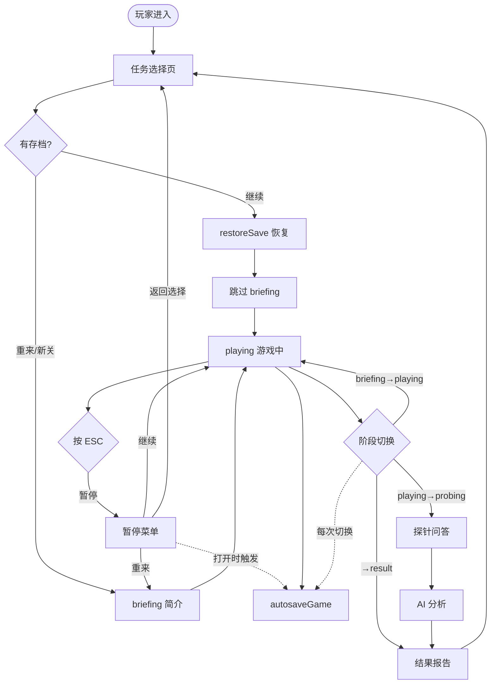
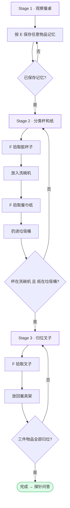
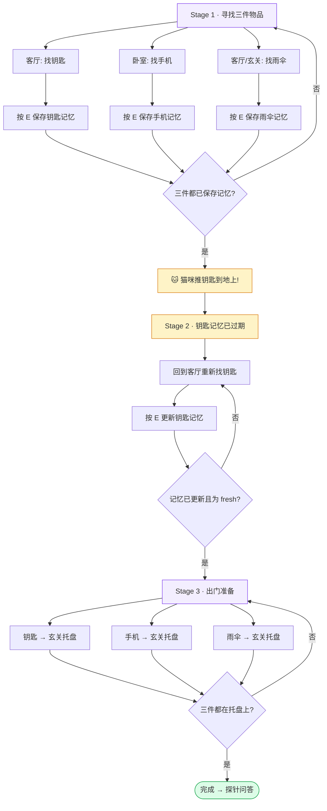
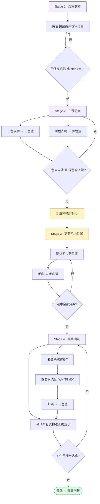
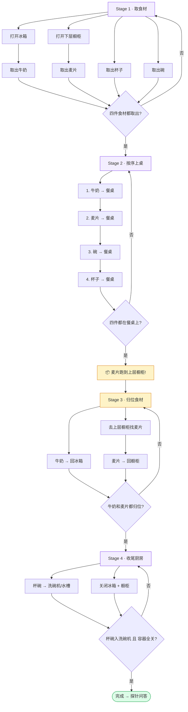
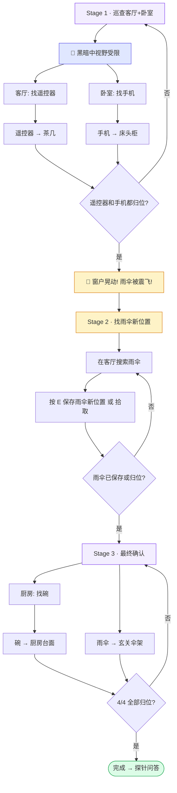

# 玩法流程图

本文件用 Mermaid 流程图描述游戏整体循环和每个关卡的玩法编排。
所有流程图均可在 GitHub / VS Code Mermaid 预览中直接渲染。

源码对应关系：
- 关卡定义 → [src/data/tasks/](../src/data/tasks/)
- 阶段引擎 → [src/game/flow.ts](../src/game/flow.ts) (`StageContext` / `StageDef`)
- 暂停/存档 → [src/components/arena3d/PauseMenu.tsx](../src/components/arena3d/PauseMenu.tsx) / [src/save/saveSystem.ts](../src/save/saveSystem.ts)

---

## 1. 游戏主循环

涵盖从任务选择到结果页的完整流程，包含暂停/存档分支。

### 暂停/存档交互要点

- **ESC 触发**：playing / briefing 阶段按 ESC → `setPaused(true)` + `exitPointerLock()`
- **暂停时冻结**：3 套 AudioContext suspend + `tickElapsed` 跳过
- **存档触发时机**：60 秒定时器 / 阶段切换 / 暂停菜单打开
- **存档格式**：单槽覆盖，key = `homemem_autosave_<taskId>`，含 `version` + `taskConfigHash` 双校验
- **恢复流程**：`restoreSave` → 校验 version + hash → `loadFromSave` 恢复 game state + session data → 跳过 briefing

---

## 2. 关卡 1：初次整理（task-clean-table）

- **角色**：tutorial 教学关
- **房间**：餐厅
- **物品**：脏杯子、餐巾纸、叉子
- **容器**：餐桌、洗碗机、垃圾桶、餐具架
- **混乱事件**：无（教学关禁用）

### 探针题（3 题）

| ID | 类型 | 考察点 |
|----|------|--------|
| p-cup-location | 空间记忆 | 杯子最终位置 |
| p-trash-destination | 物体记忆 | 餐巾纸扔到了哪 |
| p-fork-destination | 程序记忆 | 叉子放回哪 |

---

## 3. 关卡 2：出门大作战（task-leave-home）

- **角色**：semifinal-core 核心关
- **房间**：客厅、卧室、玄关
- **物品**：钥匙、手机、雨伞
- **容器**：茶几、床头柜、伞架、玄关托盘
- **核心机制**：猫咪推钥匙 → 记忆过期 → 必须更新

### 混乱事件

| 事件 ID | 触发条件 | 效果 |
|---------|---------|------|
| se-cat-pushes-key | step >= 8 且钥匙未归位 | 猫将钥匙推到地上，钥匙记忆过期 |
| se-phone-ringing | step >= 5 | 手机铃声提示位置 |

### 探针题

| ID | 类型 | 考察点 |
|----|------|--------|
| p-key-initial-location | 空间记忆 | 钥匙最初在哪 |
| p-key-outdated-event | 时间记忆 | 记忆何时过期 |
| p-phone-location | 空间记忆 | 手机最终位置 |

---

## 4. 关卡 3：洗衣幽灵（task-laundry-sort）

- **角色**：challenge 挑战关
- **房间**：洗衣房
- **物品**：9 件衣物（白衬衫、白袜子、小白巾、黑T恤、牛仔裤、黑袜子、大浴巾、小方巾、彩色条纹衬衫）
- **容器**：白色篮、深色篮、毛巾篮
- **核心机制**：幽灵交换篮子位置、藏袜子、移动毛巾

### 混乱事件

| 事件 ID | 触发条件 | 效果 |
|---------|---------|------|
| se-cat-moves-clothes | step >= 6 | 猫移动衣物位置 |
| se-cat-moves-towel | step >= 10 | 幽灵移动毛巾到新位置 |
| se-cat-hides-dark-socks | step >= 8 | 猫藏起黑袜子 |
| se-baskets-swapped | step >= 12 | 白篮和深篮位置交换 |
| se-mystery-item-appears | step >= 14 | 彩色条纹衬衫出现 |

### 探针题

| ID | 类型 | 考察点 |
|----|------|--------|
| p-count-white | 计数记忆 | 白色衣物有几件 |
| p-count-towel | 计数记忆 | 毛巾有几件 |
| p-classify-jeans | 程序记忆 | 牛仔裤归类 |
| p-socks-final | 物体记忆 | 袜子最终位置 |

---

## 5. 关卡 4：早餐时间循环（task-breakfast）

- **角色**：challenge 隐藏关
- **房间**：厨房、餐厅
- **物品**：牛奶、麦片、杯子、碗、勺子
- **容器**：冰箱、上层橱柜、下层橱柜、厨房台面、水槽、洗碗机、垃圾桶、餐桌
- **核心机制**：麦片自动跑到上层橱柜、冰箱自动关门、牛奶超时扣分

### 混乱事件

| 事件 ID | 触发条件 | 效果 |
|---------|---------|------|
| se-cereal-moved-to-cabinet | 四件上桌后 | 麦片自动移到上层橱柜 |
| se-fridge-auto-close | step >= 15 | 冰箱门自动关闭 |
| se-milk-deduct-points | 牛奶在外超时 | 扣分警告 |
| se-milk-deduct-more | 牛奶继续在外 | 扣更多分 |
| se-wrong-affordance-use | 放错容器 | 提示正确容器 |
| se-cat-timer | 猫干扰 | 计时异常提示 |

### 探针题

| ID | 类型 | 考察点 |
|----|------|--------|
| p-spatial-cereal-location | 空间记忆 | 麦片跑到哪了 |
| p-object-state-fridge | 物体记忆 | 冰箱最终状态 |
| p-temporal-order | 时间记忆 | 上桌顺序 |
| p-procedural-missing-step | 程序记忆 | 漏了哪一步 |
| p-spatial-cereal-final | 空间记忆 | 麦片最终位置 |
| p-object-state-milk | 物体记忆 | 牛奶最终状态 |
| p-temporal-penalty | 时间记忆 | 扣分事件 |

---

## 6. 关卡 5：深夜巡逻（task-night-patrol）

- **角色**：challenge 隐藏关
- **房间**：客厅、卧室、厨房、玄关、餐厅
- **物品**：遥控器、手机、碗、雨伞
- **容器**：客厅茶几、卧室床头柜、厨房台面、玄关伞架
- **核心机制**：黑暗视野（只能看清近处）、窗户晃动震飞雨伞

### 混乱事件

| 事件 ID | 触发条件 | 效果 |
|---------|---------|------|
| se-darkness-vision | 开局 | 黑暗视野，只能看清近处 |
| se-appliance-hum | step >= 6 | 电器异响提示 |
| se-owner-asleep | 全程 | 主人睡觉，需安静 |
| se-window-rattle | step >= 10 | 窗户晃动震飞雨伞 |
| se-phone-glow | step >= 8 | 手机微光提示位置 |
| se-half-time-check | 时间过半 | 半程检查提示 |
| se-cat-sight | step >= 15 | 猫影闪过 |

### 探针题

| ID | 类型 | 考察点 |
|----|------|--------|
| p-spatial-remote-home | 空间记忆 | 遥控器归属 |
| p-spatial-phone-found | 空间记忆 | 手机在哪找到 |
| p-spatial-umbrella-home | 空间记忆 | 雨伞最终位置 |
| p-temporal-window-event | 时间记忆 | 窗户晃动事件 |

---

## 图例

| 颜色 | 含义 |
|------|------|
|  | Stage 阶段入口 |
|  | 混乱/意外事件 |
|  | 关卡完成 |
|  | 环境状态（如黑暗） |
